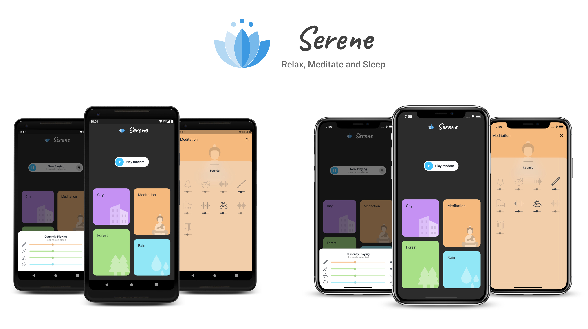
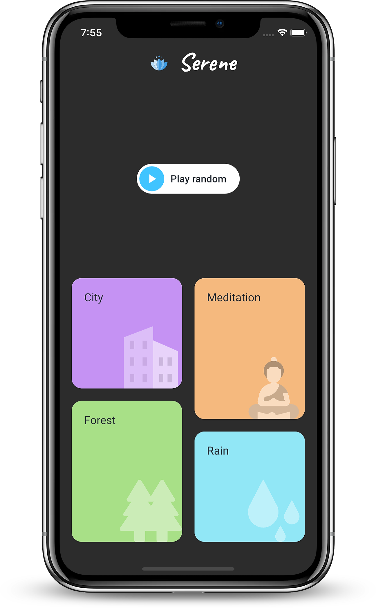
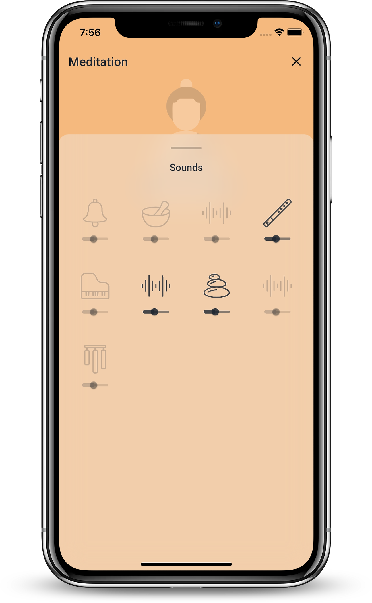
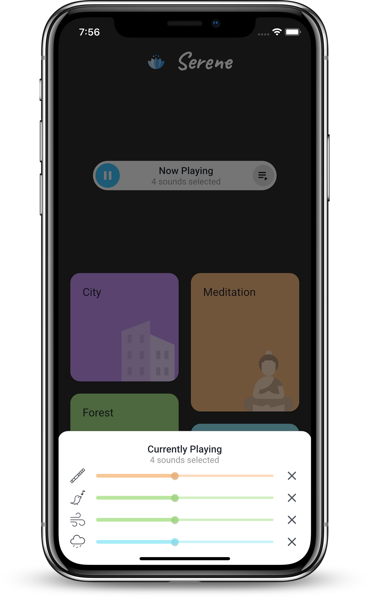

  
# Serene - Relax, Meditate and Sleep  
A white noise app developed with [Flutter](https://flutter.dev/). It helps you meditate, sleep better, focus, relax and be calm. 

**Screenshots:**

  
   
  

**Features:** 
* Play multiple sounds simultaneously
* Adjust the sound volume individually

**Libraries:**
* [Bloc](https://bloclibrary.dev/#/): Bloc Architecture
* [AudioPlayers](https://github.com/luanpotter/audioplayers): Supports multiple simultaneous playing
* [Material Animations](https://pub.dev/packages/animations)
* [Flare](https://github.com/2d-inc/Flare-Flutter): Logo Animation

**Serene logo animation available on** [Rive](https://rive.app/a/vipulasri/files/flare/serene-logo).

**Credits:**
* **Design Inspiration:** [Meditation App](https://dribbble.com/shots/10955074-Meditation-APP) by Dragon Lee
* **Icon:** free personal usage from [FlatIcon](https://www.flaticon.com/) 
* **Images and Audios:** all from internet resources

## License

    Copyright 2020 Vipul Asri

    Licensed under the Apache License, Version 2.0 (the "License");
    you may not use this file except in compliance with the License.
    You may obtain a copy of the License at

       http://www.apache.org/licenses/LICENSE-2.0

    Unless required by applicable law or agreed to in writing, software
    distributed under the License is distributed on an "AS IS" BASIS,
    WITHOUT WARRANTIES OR CONDITIONS OF ANY KIND, either express or implied.
    See the License for the specific language governing permissions and
    limitations under the License.
